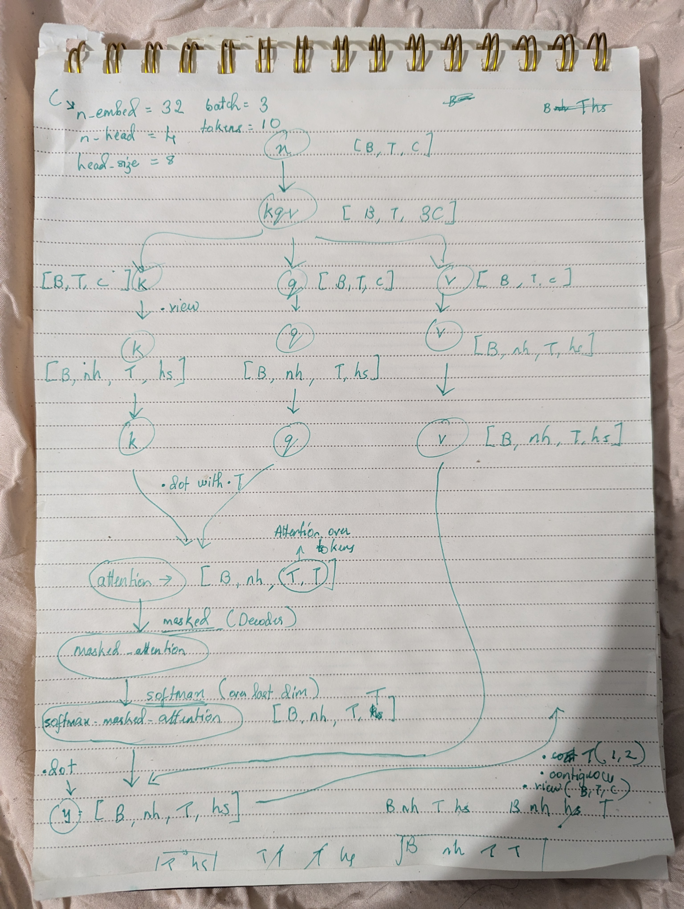
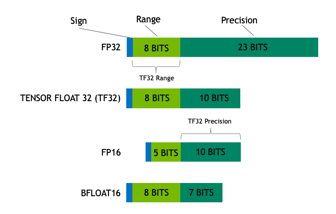
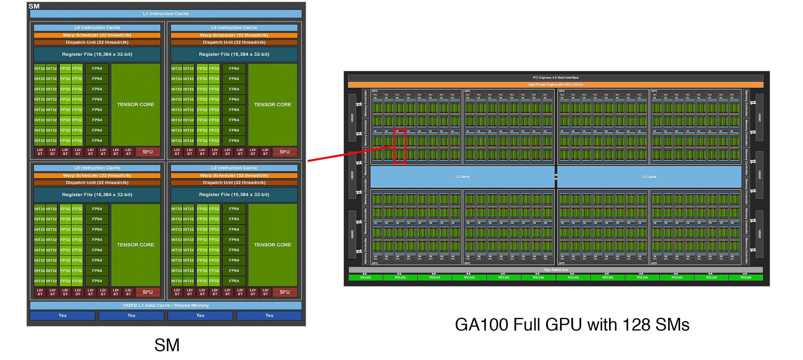
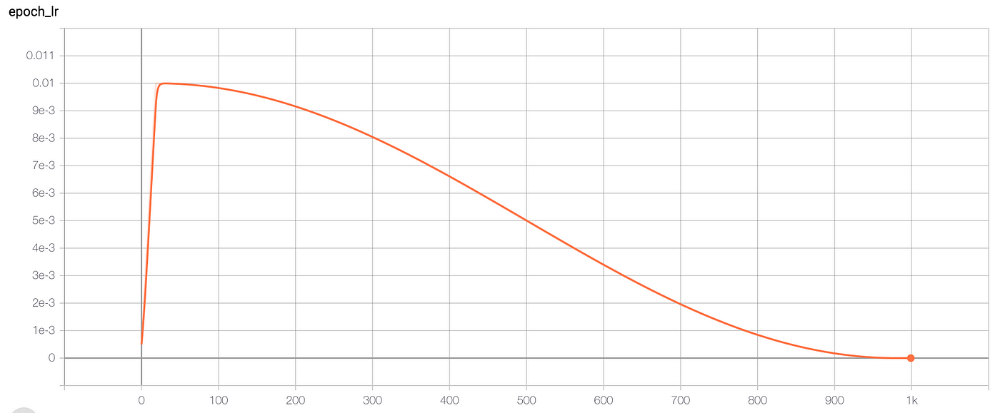

# Recreating GPT-2

## Basics and starter code

- We recreate the model arch from hugging face
- The position encodings are a sinosudal wave. We can extract a particular channel value from position encodings and plot it's value across block_size (How a particular dim in the embedding change with context length)

- use @dataclass decorator for a Data class like a config class.

- torch.view() needs the tensors to be in continuous memory. Some operations, including transpose, breaks this continuity. Then you could use `.contingous().view()` or `.reshape()`

- We start with the `GPT class` most high level. Then implement the `Block` class that goes inside it, Then finally the `MLP` and `SelfAttention`.

- Loading a model from hugging face and converting it into a `state_dict()` and then viewing and replicating the model is easier.

- When we get the logits and extract the last token's logits [B, vocab_size], and do a softmax to sample, before sampling from this probability, we wanna pick out top `k` probabilities from this distribution and then only sample from then which negates the chance of sampling a very rare token.

- A `nn.ModuleDict()` has a dict() inside with name(key) and nn.Module()(value). Similarly a `nn.ModuleList()` has a list of nn.Modules and indexed by integer

- Gpt-2 tokenizer compression ratio is roughly 3:1. 1/3rds the input.

- `model.to(device)` happens in-place. However, `tensor.to(device)` does not. And it returns a new tensor.

## Always overfit a single batch of input first

## Create a data-loader now to give you a fresh batch each time

## Sharing Token embedding and output embedding layers!

- In the embeddings matrix, similar simantic words have very similar embeddings. And the same is true for the output layer that gives probabilities. (lm_head)
- We want these to give high probabbilities to similar semantic words. We could use the same matrix as recommended by Attention paper.

- It is a very costly layer and it saves lot of computation and gives better results.

# Maintaining of std = 1.0 for layer that get merges from skip connections

- Since we add values from residual connections, the std is not 1.0 anymore. It increases, therefore, to compensate, they recommend initializing the std of these layers by `(1.0/n**0.5)` where n is the number of layers of residual merges.
In out case n will be 2*n_layers since in each block we do two merges and we have n_layers blocks. So we set c_prop layer to have a low std.

## Speed Up!!

- FP -> floating point precision
- TF -> Tensor float

- By default the tensors have a dtype of float32 and means each value takes 32 bits
- So if a FP32 matrix multiplied by FP32 matrix, the output type is FP32 but an NVIDIA GPU will convert that internally to TF32 to perform calculations much faster with a cost of answers being marginally approximate which is negligible but 8x more speed in A100.
Basically crops out some precision
`torch.set_float32_matmul_precision('high)`
- A good measure is tokens per second btw
- Bfloat16 offers even more speed with lesser precision. 
- To convert to bfloat 32, only add this to forward pass, and nothing in backward pass.

bash
'''
with torch.autocast(device_type = device, dtype = bfloat16):
logits, loss = model(x, y)
'''

## Torch Compile

`torch.compile` -> It's a compilier similar to gcc but for neural networks.

- It reduces Python overhead and GPU read/writes.

- It sees the Entire model and knows what kind of operations we are going to perform. And it removes the python interpreter which goes line by line and instead compiles the whole thing and optimizes it based on knowing every operation.

- Reduces many round trips from GPU kernal to GPU memory to a single round trip. (This trip has a bandwidth which is costly). `Also called kernal fusion`.

# FuseAttention (2022)

- The torch.compile does not work the best with the attention block where we do [T, T] matrix calculation. FuseAttention uues the fusion of GPU kernals where they have L3 RAM to only perform attention more efficiently. The entire attention matrix is never materialized and they calculate a softmax on the run itself. (Instead of after getting all the values). This was the GPU makes only 1 round trip to HMB memory. Even tho this operation performs more Terraflops of operations, it is roughly 7x faster because all of it is happening inside the kernal itself which is very fast.

- `F.scaled_dot_product_attention(q, k, v, is_casual = True)` When we use this attention implementation torch.compile() will call the Flash attention and this will run on fused kernal. No idea why it does not call flashattention when we write our own attention block.

## Cosine Decay learning rate schedule with warmup

- Increases linearly, then decreases with a cosine curve, until a minimum value.

## Gradient Accumulation

- If the batch_size we want is too high for our tiny GPU, we can simulate the effects of the higher batch_size by accumulating the gradients and running longer.
- For example, we want to simulate a batch size of 524,288 batches and tokens (B*T) at once.
- We can have a micro batch and token size of say B = 16, T = 1024.
- We make sure that this bigger number is perfectle divisible by this micro batch.
- We take this [B, T] and feedforward, we calculate the gradients but don't update the parameters. The we take another [B, T] and feedward this micro batch and accumulate the gradients and only update the parameters when entire big batch is simulated.

- A bug in the gradient accumulation is the following - 

Suppose the loss is a mean squared error loss for a toy example where logits [4, 1] and y [4,]

loss = [1/4 *
            (logits[0, 0], y[0]),
            (logits[1, 0], y[1]),
            (logits[2, 0], y[2]),
            (logits[3, 0], y[3]),
]
This is the simple mean squared error loss

Now if we pass a batch of 4 like above, the loss will be averaged (1/4).
If we pass single example as micro batches and 4 steps of accumulating and updating, we `completely negate the mean part of the equation`. So Loss accumulation for a mean-kinda loss function is basically just summing it up.
To compensate for this, we need to divide the loss by 4 or num_of_steps accumulating basically to account for the mean.

## Distributed Data Parallel (DDP)

- If we have 8 GPUs, we can run 8 processes and each process will run on one GPU.
- They will process different parts and in the end we average kinda merge them.
- The processes are launched not via normal python run now but via torch.run which runs 8 processes in parallel.

- Check the DDP implemetation code in gpt_2.py

-   ddp_rank = int(os.environ['RANK'])                  # Unique ID for each process of each node
    ddp_local_rank = int(os.environ['LOCAL_RANK'])      # Unique ID for each process within a node (Used for setting GPU number)
    ddp_world_size = int(os.environ['WORLD_SIZE'])      # Number of processes participating

- `torchrun --standalone --nproc_per_node 8 gpt2.py`

- This launches 8 processes with unique ranks all running at the same time
- We need to make changes to some code to know now we are running multiple processes

- Like grad_accum_steps now is `[B, T, #processes]`

- The data is shared between the GPU's and this the data loading, (getting a batch should not be same for all and we add a clever offset based on which process it is)

- The `DistributedDataParallel` class wraps the model in a DDP class which makes no change in the forward pass, but during backward pass, when the gradients from each process is accumulated, it averages out all gradients from each process and populates the average in each process's gradients.
Pretty neeeeeet!!!!!

- The DDP() will do an all_reduce() after backpropagation that will propagate the average gradients too all processes. This is done when loss.backward() is called.

- In our code, this sync will happen in every iteration of micro_batch calculation because we do forward and backward for every micro bitch and later take optimization step. We want to sync only after the entire micro batches gradients have been populated. Then we once do a all_reduce() and take a step of optimization.

# Datasets

- OpenAI does not release the datasets but mention the content and there are open source options available.

- RedPajama is a popular dataset with 1.21T tokens and SlimPajama is a smaller version of RedPajama with 627B tokens

- FineWeb is a new dataset with 15T tokens that takes 44TB of disk space. It is curation of lot's of sources including common crawl.

- FineWeb-Edu is a subset of FineWeb datset with education content. It comes in 1.3T and 5.4T token sizes.

- There are samples of sizes 10B, 100B and 350B tokens.