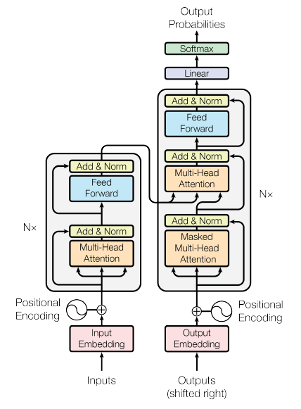

# Recreating GPT-2

- We recreate the model arch from hugging face
- The position encodings are a sinosudal wave. We can extract a particular channel value from position encodings and plot it's value across block_size (How a particular dim in the embedding change with context length)
- 